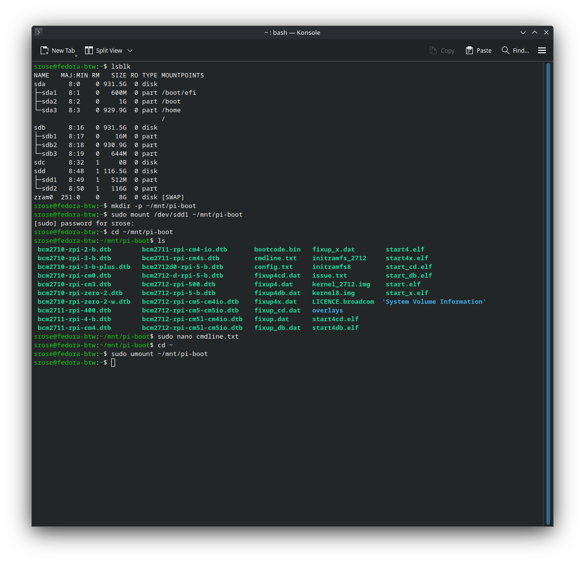
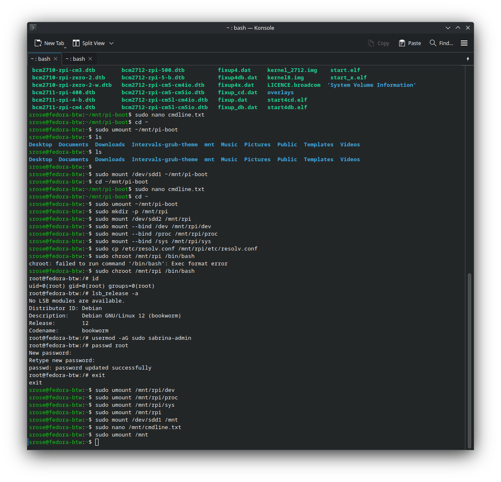
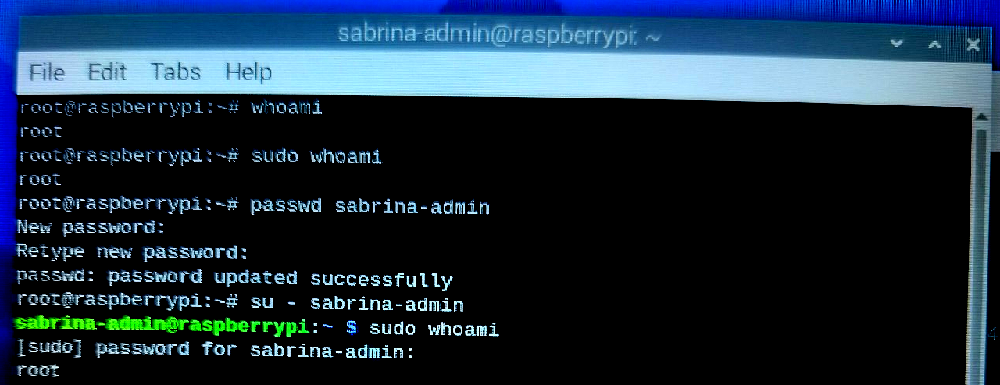
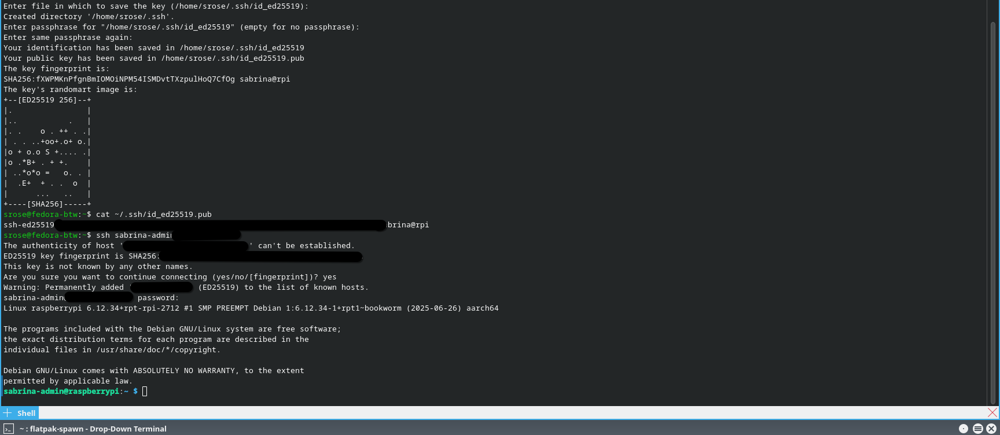

# core-secure-ssh-hardening

## Date
2025-07-27

## Author
sabrinaderose

## Repository
[https://github.com/sabrinaderose/core-secure-ssh-hardening](https://github.com/sabrinaderose/core-secure-ssh-hardening)

## Category
Homelab | Configuration | Documentation

## Related Certifications
- CompTIA A+ (Earned)
- LPI Linux Essentials (Earned)
- Cisco CCNA (Upcoming)

---

## 🎯 Objective

This project documents the secure configuration of a Raspberry Pi 5 for remote access over SSH using public-key authentication. The goal is to learn hands-on system hardening fundamentals and practice configuring a headless, SSH-only administration setup suitable for production or lab environments.

---

## 🖥️ Environment & Tooling

### 🔧 Hardware Used
- Raspberry Pi 5 (4GB Model)
- Official Raspberry Pi 5 case + fan
- 128GB Class 10 microSD (preloaded with Raspberry Pi OS 64-bit)
- iPistBit 7" Touchscreen (1024x600 IPS)
- Vilros USB Keyboard w/ Touchpad
- USB-C 27W Power Supply

### 💻 Software Environment
- Raspberry Pi OS Bookworm 64-bit (2025)
- Kernel: `6.6.x` (as installed from Pi image)
- Desktop: LXDE (used only for initial setup)
- Package Manager: `apt`
- Services: `openssh-server`

---

## 🛜 Network Topology
Local Wi-Fi LAN with SSH access from main workstation. DHCP assigned IP (`192.168.x.x`), resolved using `hostname -I`.

---

## 🔧 Step-by-Step Process

### 🔹 Phase 1: Preparation
- Assembled Pi 5 with touchscreen, keyboard, and cooling
- Inserted microSD with Raspberry Pi OS
- Booted and confirmed OS initialization
- Verified system packages up-to-date:
  ```bash
  sudo apt update && sudo apt full-upgrade -y
  ```

- Created secure admin user:
  ```bash
  sudo adduser sabrina-admin
  sudo usermod -aG sudo sabrina-admin
  ```

### 🔹 Phase 2: Configuration
- Installed & enabled OpenSSH:
  ```bash
  sudo apt install openssh-server -y
  sudo systemctl enable ssh
  sudo systemctl start ssh
  ```

- Generated ED25519 SSH key from external machine:
  ```bash
  ssh-keygen -t ed25519 -C "sabrina@rpi"
  ```

- Added public key to `~/.ssh/authorized_keys` for `sabrina-admin`
- Set correct permissions:
  ```bash
  chmod 700 ~/.ssh
  chmod 600 ~/.ssh/authorized_keys
  chown -R sabrina-admin:sabrina-admin ~/.ssh
  ```

- Hardened `sshd_config`:
  ```conf
  PermitRootLogin no
  PasswordAuthentication no
  PubkeyAuthentication yes
  ```

- Restarted SSH daemon:
  ```bash
  sudo systemctl restart ssh
  ```
### 🔹 Phase 3: sudo Lockout and Root Password Issue

After hardening the SSH configuration and setting up the new `sabrina-admin` user, I encountered a critical access issue:

- The `sabrina-admin` user was **not in the `sudoers` file**, and thus could not use `sudo`.
- The `root` user had a **pre-set and unknown password**, making it impossible to escalate privileges locally.
- The original `pi` user account was not available, and SSH password authentication was already disabled per the hardening process.

This left me in a position where **no user had administrative access**, effectively locking me out of making system-level changes on the Raspberry Pi.

---

### 🔹 Recovery Process Using Fedora Linux

To resolve this, I physically removed the microSD card from the Raspberry Pi and used a Fedora workstation to:

1. **Mount the Raspberry Pi's root file system.**
2. **Use `chroot` to enter the Pi's environment.**
3. **Reset the root password.**
4. **Add `sabrina-admin` to the `sudo` group.**

This restored administrative access without compromising any SSH hardening or system security.

---

### 🔹 Phase 4: Testing
- Verified SSH login via public key from main system:
  ```bash
  ssh sabrina-admin@192.168.x.x
  ```

- Confirmed:
  - No password prompt
  - Shell login worked
  - Permissions correctly applied

### 🔹 Phase 5: Troubleshooting
- Disabled on-screen keyboard (`squeekboard`) due to touchscreen interference:
  ```bash
  sudo apt purge squeekboard -y
  sudo apt autoremove -y
  ```

- Rebooted and confirmed no interference with terminal usage

---

## 🔍 Analysis & Reflection

This lab demonstrated how to secure a newly provisioned Raspberry Pi for headless administration. The process revealed subtle but critical security practices, such as file permissions, disabling unnecessary input devices, and enforcing public key-only SSH authentication. Real-time testing helped validate changes and build hands-on comfort with system-level controls.

---

## ✅ Final Outcome

The Raspberry Pi 5 was successfully configured to:
- Accept SSH logins via key only
- Deny password or root access
- Operate cleanly without desktop or touchscreen interference

This project shows competency in Linux administration, remote access control, and security-first thinking.

## 📸 Recovery Figures and Verification

> The following images are embedded below for clarity, documentation, and reference within this lab.

---

### **Figure 1: Mounting the Pi's Filesystem in Fedora**



*This shows mounting /dev/sdd1 into /mnt/pi-boot to edit cmdline.txt, preparing the Pi for direct access after SSH lockout*

---

### **Figure 2: Inside the Pi’s Filesystem via chroot**



*After mounting the full Pi filesystem, this image demonstrates entering a chroot jail on the Pi via Fedora to directly modify system settings (e.g., user password, sudo privileges, resolv.conf). We reset the root password directly from the chrooted Fedora environment.*

---

### **Figure 3: Root login and sudo confirmation*



*This confirms that sabrina-admin was added to the sudo group and a password was successfully set for root access.*

---

### **Figure 4: Verifying SSH Login after Recovery**



*Demonstrates successful SSH authentication via keypair from Fedora to Raspberry Pi as sabrina-admin, verifying SSH hardening was properly configured.*

---

### **Figure 5: Physical Interior of Raspberry Pi Unit**


*Internal view of the Raspberry Pi setup during the lab, highlighting the heatsink and cooling fan used for long-term uptime and security appliance simulation.*

---

### **Figure 6: Full Lab Setup**


*The complete workstation configuration used for the SSH hardening lab: Pi connected to a 7” screen, compact keyboard with touchpad, and powered by Fedora host for diagnostics.*

---

## 🧠 Interview/Resume Summary (STAR Format)

**S:** Assigned to configure a Raspberry Pi 5 for secure remote access  
**T:** Ensure only trusted devices could log in without exposing passwords or GUI  
**A:** Installed and hardened SSH with key-only auth, disabled root + passwords, removed GUI interference  
**R:** Built a headless, secure, SSH-managed Pi ready for future automation, with no open attack surfaces

---

## 📚 References & Resources
- [Official Raspberry Pi OS Docs](https://www.raspberrypi.com/documentation/)
- [Ubuntu SSH Hardening Guide](https://wiki.ubuntu.com/SSH/OpenSSH/Configuring)
- `man sshd_config`
- StackOverflow/ArchWiki for `xinput`, `squeekboard`, `authorized_keys`
